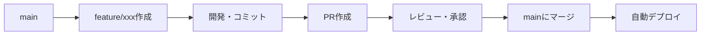

# Gitブランチ戦略

PromptLabプロジェクトのブランチ戦略とワークフローを定義します。

## 🎯 推奨戦略: GitHub Flow（シンプル版）

このプロジェクトには**GitHub Flow**が最適です。

**理由**:
- ✅ シンプルで理解しやすい
- ✅ Vercelとの連携が簡単（`main`ブランチへのマージで自動デプロイ）
- ✅ 小規模〜中規模プロジェクトに適している
- ✅ 継続的デプロイ（CD）に最適
- ✅ 運用が簡単

---

## 📋 ブランチ構成

### メインブランチ

#### `main`（本番環境）
- **用途**: 本番環境にデプロイされるコード
- **保護**: ✅ 必須（直接プッシュ禁止、PR必須）
- **デプロイ**: Vercelが自動的に本番環境にデプロイ
- **状態**: 常にデプロイ可能な状態を保つ

### 機能ブランチ

#### `feature/*`（機能開発）
- **命名規則**: `feature/機能名` または `feature/issue番号-機能名`
- **例**: 
  - `feature/user-authentication`
  - `feature/search-functionality`
  - `feature/123-add-bookmark`
- **用途**: 新機能の開発
- **マージ先**: `main`

#### `fix/*`（バグ修正）
- **命名規則**: `fix/修正内容` または `fix/issue番号-修正内容`
- **例**: 
  - `fix/login-error`
  - `fix/456-search-bug`
- **用途**: バグの修正
- **マージ先**: `main`

#### `docs/*`（ドキュメント）
- **命名規則**: `docs/更新内容`
- **例**: `docs/update-readme`, `docs/add-api-docs`
- **用途**: ドキュメントの更新のみ
- **マージ先**: `main`

#### `refactor/*`（リファクタリング）
- **命名規則**: `refactor/対象`
- **例**: `refactor/component-structure`
- **用途**: コードのリファクタリング（機能追加なし）
- **マージ先**: `main`

#### `style/*`（スタイル）
- **命名規則**: `style/対象`
- **例**: `style/format-code`
- **用途**: コードフォーマット、スタイルの変更のみ
- **マージ先**: `main`

---

## 🔄 ワークフロー

### 基本的な開発フロー



### 詳細ステップ

#### 1. 機能開発を開始

```bash
# mainブランチから最新を取得
git checkout main
git pull origin main

# 機能ブランチを作成
git checkout -b feature/user-authentication

# 開発開始
```

#### 2. 開発中（コミット）

```bash
# 変更をステージング
git add .

# コミット（Conventional Commits推奨）
git commit -m "feat: add user authentication"

# 定期的にリモートにプッシュ
git push origin feature/user-authentication
```

**コミットメッセージの形式**:
- `feat: 新機能追加`
- `fix: バグ修正`
- `docs: ドキュメント更新`
- `style: コードフォーマット`
- `refactor: リファクタリング`
- `test: テスト追加`
- `chore: その他（ビルド設定など）`

#### 3. プルリクエスト（PR）作成

```bash
# 最後のプッシュ後、GitHubでPRを作成
# または GitHub CLIを使用
gh pr create --title "feat: add user authentication" --body "ユーザー認証機能を追加"
```

**PRテンプレート**:
- 変更内容の説明
- 関連Issue（あれば）
- スクリーンショット（UI変更の場合）
- チェックリスト

#### 4. レビュー・承認

- コードレビューを実施
- CI/CDのチェックが通ることを確認
- 承認後にマージ

#### 5. マージ後

- `main`ブランチに自動マージ
- Vercelが自動的にビルド・デプロイ
- 本番環境に反映

---

## 🚫 避けるべきこと

### ❌ mainブランチへの直接プッシュ
```bash
# これは禁止
git push origin main
```

### ❌ 長期間放置されたブランチ
- 1週間以上放置されたブランチは定期的に整理
- `main`と差分が大きくなりすぎないように注意

### ❌ 大きなPR
- 1つのPRは1つの機能に集中
- 大きすぎる場合は分割を検討

---

## 🔧 高度な運用（オプション）

### ステージング環境が必要な場合

本番環境の前にテスト環境が必要な場合：

#### `develop`ブランチを追加
- **用途**: 開発・テスト環境
- **デプロイ**: Vercelのプレビュー環境
- **フロー**: `feature/*` → `develop` → `main`

```
feature/* → develop（ステージング） → main（本番）
```

**メリット**:
- 本番前にテスト可能
- 複数の機能を統合してテスト

**デメリット**:
- 運用が複雑になる
- 小規模プロジェクトには過剰

**推奨**: 最初はGitHub Flowで開始し、必要になったら`develop`ブランチを追加

---

### ホットフィックス（緊急修正）

本番環境の緊急バグ修正の場合：

```bash
# mainから直接ホットフィックスブランチを作成
git checkout main
git checkout -b hotfix/critical-bug

# 修正・コミット
git commit -m "fix: critical security issue"

# PR作成（緊急のため迅速にレビュー・マージ）
# mainにマージ後、必要に応じてfeatureブランチにもマージ
```

---

## 📊 ブランチ戦略の比較

| 戦略 | 複雑さ | 適用規模 | Vercel連携 |
|------|--------|----------|------------|
| **GitHub Flow** | ⭐ 低 | 小〜中規模 | ✅ 簡単 |
| Git Flow | ⭐⭐⭐ 高 | 大規模 | ⚠️ 設定必要 |
| GitLab Flow | ⭐⭐ 中 | 中規模 | ⚠️ 設定必要 |

**このプロジェクト**: GitHub Flowが最適 ✅

---

## 🛠️ 実装手順

### 1. mainブランチの保護設定

GitHubリポジトリの設定：
1. Settings > Branches
2. Add rule
3. Branch name pattern: `main`
4. ✅ Require a pull request before merging
5. ✅ Require approvals（必要に応じて）
6. ✅ Require status checks to pass before merging

### 2. ブランチ命名規則の統一

チームで命名規則を統一：
- `feature/*`: 新機能
- `fix/*`: バグ修正
- `docs/*`: ドキュメント
- `refactor/*`: リファクタリング

### 3. PRテンプレートの作成

`.github/pull_request_template.md`を作成：

```markdown
## 変更内容
- 

## 関連Issue
- 

## スクリーンショット（UI変更の場合）
- 

## チェックリスト
- [ ] コードレビュー済み
- [ ] テスト追加・更新
- [ ] ドキュメント更新
- [ ] ビルドエラーなし
```

---

## 📝 コミット規約（Conventional Commits）

### 形式
```
<type>(<scope>): <subject>

<body>

<footer>
```

### 例

```bash
# 機能追加
git commit -m "feat(auth): add user login functionality"

# バグ修正
git commit -m "fix(search): resolve search result pagination issue"

# ドキュメント
git commit -m "docs: update API documentation"

# リファクタリング
git commit -m "refactor(components): extract common button component"

# スタイル
git commit -m "style: format code with prettier"
```

---

## 🎯 まとめ

### 推奨構成（シンプル版）

```
main（本番）
  ↑
  ├── feature/*（機能開発）
  ├── fix/*（バグ修正）
  ├── docs/*（ドキュメント）
  └── refactor/*（リファクタリング）
```

### 運用ルール

1. ✅ `main`ブランチは常にデプロイ可能な状態
2. ✅ 機能開発は`feature/*`ブランチで実施
3. ✅ PR必須（直接プッシュ禁止）
4. ✅ マージ後は自動デプロイ
5. ✅ コミットメッセージはConventional Commitsに従う

### 開始方法

```bash
# 1. mainブランチを保護設定
# （GitHubのSettings > Branchesで設定）

# 2. 機能開発を開始
git checkout -b feature/my-feature

# 3. 開発・コミット
git add .
git commit -m "feat: add my feature"

# 4. PR作成
git push origin feature/my-feature
# GitHubでPR作成

# 5. マージ後、自動デプロイ
```

---

**この戦略でシンプルかつ効率的に開発を進められます！🚀**

